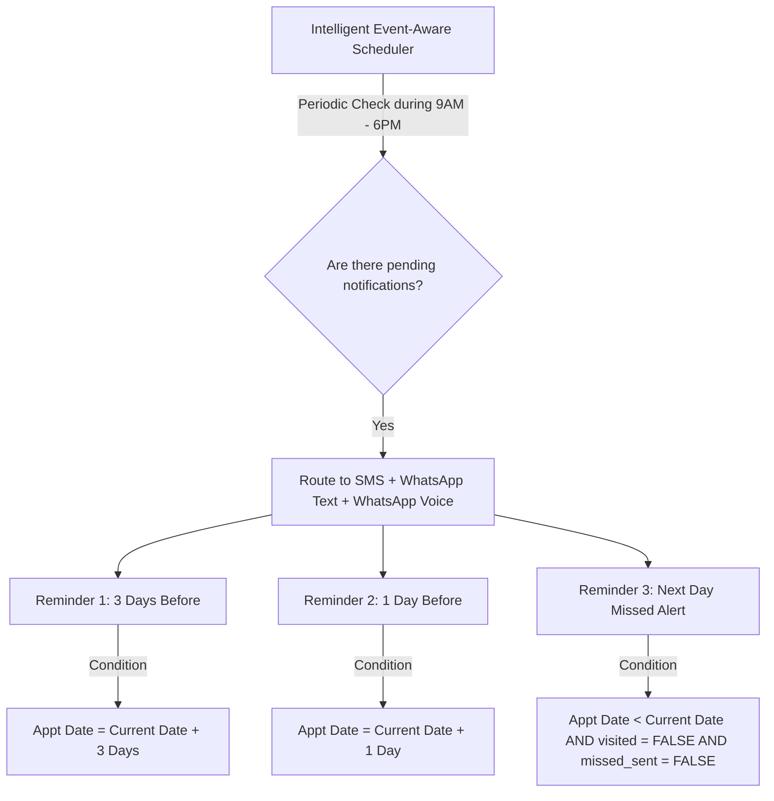

# AI Context: Dermatologist Reminder System

This document is the permanent knowledge base, architectural reference, and instructions file for the **Dermatologist Reminder System** at **AVBRH Hospital**. It is the single source of truth for all AI assistants (Antigravity, Claude, Codex, ChatGPT, Gemini, etc.) working on this codebase.

---

## 1. Project Overview

*   **Project Name**: Dermatologist Reminder System
*   **System Type**: Production-oriented Hospital Management System (Dermatology Department)
*   **Hospital**: AVBRH Hospital
*   **Department**: Dermatology Department
*   **Target Users**: Hospital Staff (Super Admins, Admins, and Receptionists)
*   **Primary Objective**: To build a simple, secure, reliable, and highly maintainable application to manage patient demographics, appointments, multi-lingual reminder schedules, and operational reports.

---

## 2. Project Vision

This is a real hospital software system destined for production deployment at AVBRH Hospital. The project must avoid prototype shortcuts. The design priorities are:
1.  **Reliability**: Critical reminders must be calculated and delivered on time.
2.  **Compliance**: Patient data (PII) must be kept secure and audit-logged.
3.  **Simplicity**: Clear layouts, clinical UI presentation, fast load times, and keyboard-friendly operational flows.
4.  **Maintainability**: Decoupled, modular code following the established Controller-Service-Repository pattern.

---

## 3. Functional Requirements

### 3.1 Patient Registration
*   Collect and store Patient Name, Phone Number, and Preferred Language.
*   Enforce a unique constraint on phone numbers to avoid duplicate patient records.

### 3.2 Appointment Management
*   **Data Structure**: Every appointment must support **Date**, **Time/Time Slot**, **Doctor**, **Department**, and **Status**.
*   **Operational Statuses**: Scheduled, Visited, Missed, Rescheduled.
*   **Check-In Actions**: Staff can mark appointments as **Visited** or **Missed**.
*   **Rescheduling**: Updating an appointment date/time automatically resets its notification states (`reminder_sent` and `missed_sent` to `FALSE`).

### 3.3 Localization
*   Supported languages for communication: **English**, **Hindi**, and **Marathi**.
*   Templates must be fully localized and grammatically accurate in all three languages.

### 3.4 Communication Channels
*   **Core Architecture**: One central reminder engine driving three mandatory channels:
    1.  **SMS**: Direct cellular carrier delivery (mandatory).
    2.  **WhatsApp Text**: Rich text alerts via WhatsApp Business API (mandatory).
    3.  **WhatsApp Voice**: Interactive voice response alerts (mandatory).
*   **Exclusion Rule**: **Email reminders are NOT part of this project.**

---

## 4. Reminder Engine & Workflow

The reminder engine is the core service of this application. It monitors the database and dispatches notifications based on the following timeline:



### Scheduling & Delivery Rules:
1.  **Reminder 1 (3 Days Prior)**: Sent exactly 3 days before the scheduled appointment.
2.  **Reminder 2 (1 Day Prior)**: Sent exactly 1 day before the scheduled appointment.
3.  **Reminder 3 (Next Day Missed Alert)**: If an appointment status remains unvisited at the end of its scheduled day, a missed alert must be sent the next day.
4.  **Language Routing**: Deliver each alert in the patient's selected language (`english`, `hindi`, or `marathi`).
5.  **Strict Working Hours**: All reminders must be dispatched **ONLY between 9:00 AM and 6:00 PM** local time. Messages must never be sent outside these working hours.
6.  **Continuous & Event-Aware Checking**: 
    *   Instead of a single daily run, the scheduler periodically checks for pending reminders throughout the working day.
    *   If an appointment is booked today for tomorrow morning, and the booking occurs before 6:00 PM today, the system must trigger and deliver today's "1 Day Prior" reminder before the 6:00 PM cutoff.

---

## 5. User Roles & Permissions

The system enforces three user levels with strict role boundaries:

```
                  ┌────────────────────────┐
                  │      Super Admin       │ (Manual creation only; system config,
                  └───────────┬────────────┘  security settings, user management)
                              │
                  ┌───────────▼────────────┐
                  │         Admin          │ (Patient records, schedule management,
                  └───────────┬────────────┘  reports, analytics, clinic operations)
                              │
                  ┌───────────▼────────────┐
                  │      Receptionist      │ (Patient registration, appointment booking,
                  └────────────────────────┘  marking Visited/Missed states)
```

1.  **Super Admin (System Owner)**:
    *   *Permissions*: Manage and create users, configure security parameters, adjust global system settings, access all data.
    *   *Note*: Created manually via secure database scripts. There is no public registration form for Super Admin roles.
2.  **Admin**:
    *   *Permissions*: Manage patients, schedule and edit appointments, generate reports, view analytics, oversee hospital operations.
    *   *Restrictions*: Cannot manage users or modify core system configurations.
3.  **Receptionist**:
    *   *Permissions*: Register patients, create appointments, mark appointments as **Visited** or **Missed**.
    *   *Restrictions*: Cannot manage users, access system configurations, view administrative logs, or access analytics pages.

---

## 6. Authentication Requirements

All authentication mechanisms must be built to production standards:
*   **JWT (JSON Web Token)**: Cryptographically signed tokens for secure session validation.
*   **bcrypt Hashing**: Hash all passwords with a minimum of 10 salt rounds before storage.
*   **Role-Based Access Control (RBAC)**: Secure routes via middleware that checks role privileges.
*   **Secure Sessions**: Short-lived access tokens with secure cookie storage and frontend-enforced logouts.
*   **Protected APIs**: Block unauthenticated requests on all endpoint paths (except `/login`).
*   **Session Timeout**: Log users out automatically after a set period of inactivity.
*   **Password Policy**: Require a minimum of 8 characters, containing uppercase, lowercase, numbers, and symbols.
*   **Audit Logs**: Keep an immutable transaction log of sensitive actions (e.g. creating/deleting users, changing roles, updating appointment states) showing user, action, IP, and timestamp.

---

## 7. Security Requirements

The application must implement security controls to comply with healthcare software standards:
*   **HTTP Protection**: Implement `helmet` to set secure response headers.
*   **Rate Limiting**: Apply rate-limiting middleware (`express-rate-limit`) to prevent brute-force attacks on authentication and registration endpoints.
*   **Parameterized Queries**: Never concatenate variables into SQL strings. Use prepared statements or parameterized queries (`db.query('...', [params])`) exclusively.
*   **Environment Isolation**: Sensitive keys, database passwords, and API credentials must be stored strictly in `.env`.
*   **Transport Encryption**: Force HTTPS/TLS for all staging and production deployments.
*   **Secure CORS**: Restrict Cross-Origin Resource Sharing (CORS) to specific hospital domains.
*   **Validation**: Validate all inputs using backend schema validators and sanitize HTML outputs to prevent cross-site scripting (XSS).
*   **Audit Trail & Logging**: System logs must rotate daily. **Never print plain-text patient phone numbers or names inside raw console/file logs**. Use masking or secure keys.

---

## 8. UI Guidelines

The user interface must be clean, practical, and optimized for hospital workloads:
*   **No Clutter**: Do not add unnecessary graphs, extra cards, decorative widgets, or heavy aesthetic animations.
*   **Fast Navigation**: Optimize layouts for speed, clear typography, and keyboard navigation (tab indexes, autofocusses).
*   **Clinical Theme**: Maintain a professional clinical color palette in both light and dark modes.
*   **Analytics Separation**: Place all analytical charts, trends, and aggregations on a **separate, restricted analytics page** rather than on the primary operational dashboard.

---

## 9. Reports

System reports must look like official hospital documents when exported:

### Document Structure:
*   **Professional Header**: Display the **Hospital Logo**, **Hospital Name** (AVBRH Hospital), **Department** (Dermatology Department), and **System Name**.
*   **Metadata Block**: Show the generated date/time and the name/role of the operator who triggered the export.
*   **Clean Grid**: Professional table formatting with readable margins, alternating row shading, and clear status columns.
*   **Footer**: Standard disclaimer text and page numbering ("Page X of Y").

### Supported Exports:
*   **CSV**: Comma-separated variables for raw data parsing.
*   **Excel (.xlsx)**: Clean worksheet output using libraries like `exceljs` (avoid HTML table hacks with `.xls` extensions).
*   **PDF**: Print-ready, vector-drawn PDF document supporting pagination and auto-wrapping text.

---

## 10. Deployment Plan

```
[Development local environment]
       ▼
[GitHub repository (Main & protected feature branches)]
       ▼
[Testing/Staging (Isolated test DB, CI/CD run)]
       ▼
[Hospital Server (On-premise deployment or private cloud)]
       ▼
[Hospital Domain (SSL configuration, local DNS setup)]
       ▼
[Production Database (Clustered MySQL with daily backups)]
       ▼
[Twilio Account (Production profile setup)]
       ▼
[WhatsApp Business API (Meta verified credentials)]
       ▼
[Production Deployment (Live release)]
```

---

## 11. Coding Standards

*   **Architecture Hierarchy**: Strictly follow the established MVC structure:
    `Controller` ➔ `Service` ➔ `Repository`
    *   *Controller*: Handles HTTP request/response payloads, status codes, and validator calls.
    *   *Service*: Processes business logic, timing rules, and routes messaging channels.
    *   *Repository*: Executes parameterized SQL statements on the database pool.
*   **Zero Duplication**: Shared helpers, schemas, and queries must be abstracted.
*   **Preservation of State**: Never modify working code or database records unnecessarily. Ensure new columns/features do not disrupt existing patient histories.
*   **Reusable UI Components**: Use modular React components.
*   **Backward Compatibility**: Ensure migrations have safe defaults and fail-safes.

---

## 12. Future Roadmap

1.  **Authentication**: staff logins, JWT validation, staff audits.
2.  **Enhanced Appointments**: Time slot scheduling, doctor profiles.
3.  **Intelligent Scheduler**: Continuous background checking for same-day booking alerts.
4.  **WhatsApp Integration**: WhatsApp Business Cloud API setup (text templates & voice scripts).
5.  **Professional Reports**: Integration of `pdfkit`/`pdf-lib` and `exceljs` for clean exports.
6.  **Security Hardening**: Field-level encryption for database columns containing patient phone numbers and names.

---

## 13. AI Instructions

All AI assistants working on this repository must strictly adhere to this workflow before making any modifications:

1.  **Analyze**: Review the existing controllers, services, database schemas, and visual components.
2.  **Explain**: Present a clear, step-by-step implementation plan detailing the affected files and proposed changes to the user.
3.  **Approve**: Stop and wait for the user to explicitly approve the plan before writing or changing code.
4.  **Implement Backend**: Write controllers, repositories, validators, and database migrations first.
5.  **Implement Frontend**: Build UI elements, services, and hooks.
6.  **Test**: Verify backend/frontend changes via postman, terminal tests, or diagnostic scripts.
7.  **Verify**: Ensure existing features (cron schedules, DB rows) remain unbroken.
8.  **Update**: Revise this `AI_CONTEXT.md` file if the system requirements change.
9.  **Commit & Push**: Suggest Git commit commands with descriptive messages.
