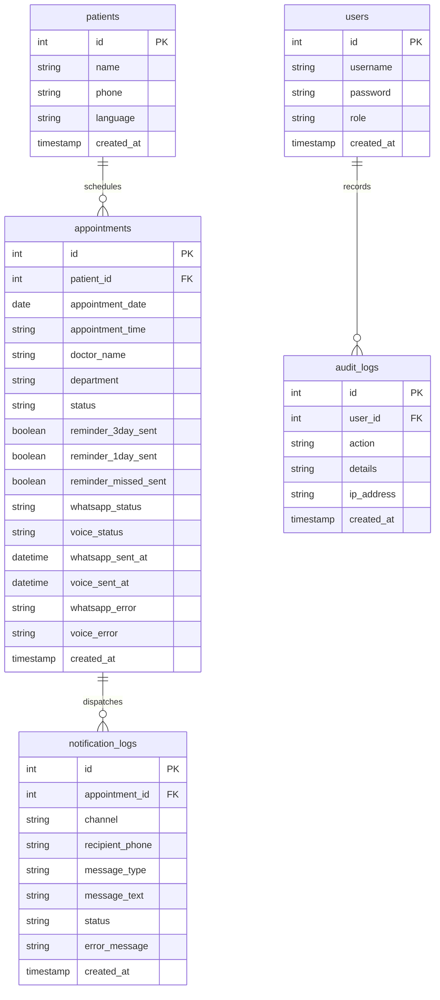

# Dermatology Appointment Reminder System (AVBRH Hospital)

A production-ready hospital application for managing patient appointments, tracking checking lifecycles, and dispatching intelligent reminders across SMS, WhatsApp, and Voice channels.

---

## 1. System Architecture


The system uses a strict **Controller ➔ Service ➔ Repository** layout ensuring proper separation of concerns:
*   **Controller**: Handles incoming requests, validates input parameters, and returns REST JSON responses.
*   **Service**: Coordinates domain logic, message text template assembly, and Twilio channels.
*   **Repository**: Handles raw MySQL parameter-safe SQL queries.

---

## 2. Folder Structure

```
dermo-reminder-system/
├── config/                 # Config configurations and message templates
├── controllers/            # API Controllers (Auth, Patient, Appointment, Analytics, Reports)
├── cron/                   # Cron scheduler setups
├── database/               # Database migration scripts
├── logs/                   # Persistent system log files (app, errors, cron, notifications)
├── middleware/             # Route authentication and role restriction guards
├── repositories/           # Direct SQL queries and DB connections wrappers
├── routes/                 # Express REST endpoint maps
├── services/               # Core business services (WhatsApp, Voice, Notification Manager)
├── utils/                  # Centralized file logging and session helper utilities
├── validators/             # Request payload sanitization rules
├── frontend/               # React client application (Vite, Tailwind, Recharts)
│   ├── src/
│   │   ├── components/     # Visual cards, tables, progress meters, and navbar layout
│   │   ├── pages/          # Login, add patient, schedules, history dashboards
│   │   └── services/       # Frontend client api wrappers
│   └── dist/               # Compiled frontend production assets
├── Dockerfile              # Multi-stage production build container definition
├── docker-compose.yml      # Services orchestration file
├── server.js               # Entry-point runner
└── README.md               # Master document
```

---

## 3. Database Schema Documentation



### Table Details:
1.  **`users`**: System login accounts. Role matches one of `'super_admin'`, `'admin'`, or `'receptionist'`.
2.  **`patients`**: Stores names, contact phones, and language preference (`'english'`, `'hindi'`, or `'marathi'`).
3.  **`appointments`**: Manages schedules, consultants, checking statuses, and delivery flags.
4.  **`notification_logs`**: Auditing history of SMS, WhatsApp, and Voice dispatch attempts.
5.  **`audit_logs`**: System activity audits tracking operations (logins, cancellations, check-ins).

---

## 4. API Documentation

### Authentication:
*   `POST /auth/login` - Public login endpoint. Returns JWT token.
*   `POST /auth/logout` - Logs out current session.
*   `GET /auth/me` - Retrieve metadata of currently authenticated session.

### Patients Management:
*   `GET /patients` - Retrieve list of patients.
*   `POST /patients` - Add new patient.

### Appointments Management:
*   `GET /appointments` - List scheduled appointments.
*   `POST /appointments` - Schedule new appointment.
*   `PUT /appointments/:id/reschedule` - Reschedule appointment and reset reminder flags.
*   `PUT /appointments/:id/visited` - Mark appointment as Visited.
*   `PUT /appointments/:id/visited` - Mark appointment as Missed.
*   `PUT /appointments/:id/cancel` - Cancel appointment.

### Notifications:
*   `GET /notifications/history` - Retrieve dispatch history log. (Admin/Super Admin only)
*   `POST /notifications/:id/retry` - Trigger manual retry resend of failed log. (Admin/Super Admin only)
*   `POST /notifications/test` - Instantly trigger test notifications. (Admin/Super Admin only)

---

## 5. Installation & Execution Guide

### Prereqs:
*   Node.js (v18+)
*   MySQL (v8.0+)
*   Twilio Account (Active credentials)

### Step 1: Install Dependencies
```bash
# Install backend dependencies
npm install

# Install frontend dependencies
cd frontend
npm install
```

### Step 2: Configure Environment (.env)
Create `.env` in the root directory:
```env
PORT=3001
DB_HOST=localhost
DB_USER=root
DB_PASSWORD=your_secure_password
DB_NAME=dermo_reminder_system

JWT_SECRET=use_a_long_random_hex_string
JWT_EXPIRES_IN=12h

TWILIO_ACCOUNT_SID=AC...
TWILIO_AUTH_TOKEN=your_token
TWILIO_PHONE_NUMBER=+1...
TWILIO_WHATSAPP_NUMBER=+14155238886

MOCK_SMS=true  # Set to false to send real SMS, WhatsApp and Voice calls
```

### Step 3: Run Database Migrations
Create databases and run scripts:
```bash
node database/create-users-table.js
node database/upgrade-appointments-table.js
node database/add-reminder-indexes.js
node database/add-whatsapp-tracking.js
```

### Step 4: Run Application
To start both servers locally:
```bash
# In Root (Start Backend)
npm start

# In /frontend (Start Frontend Dev server)
cd frontend
npm run dev
```

---

## 6. Docker Deployment Guide

To deploy the entire stack using Docker Compose:
```bash
# Build and run containers
docker-compose up -d --build
```
This spins up the MySQL server, compiles frontend static pages, starts the Express backend server on port `3001`, and links all components together.

---

## 7. User & Admin Manual

### Receptionist Workflow:
1.  **Register Patients**: Enter patient details, telephone numbers, and preferred language (English/Hindi/Marathi).
2.  **Schedule Appointment**: Specify date, consultant doctor, and time slot.
3.  **Appointment Desk Actions**: Check-in patients (Visited), mark Missed, Cancel schedules, or Reschedule.

### Admin Operations:
1.  **Staff Accounts**: Manage receptionists and admin roles.
2.  **Track Alerts History**: View the delivery status (`Sent`, `Failed`, `Retried`) of all alerts.
3.  **Manual Resend**: Press "Retry" next to any failed SMS/WhatsApp/Voice log to trigger an immediate resend attempt.
4.  **Export Data**: Download CSV/Excel reports and analytics summaries.
