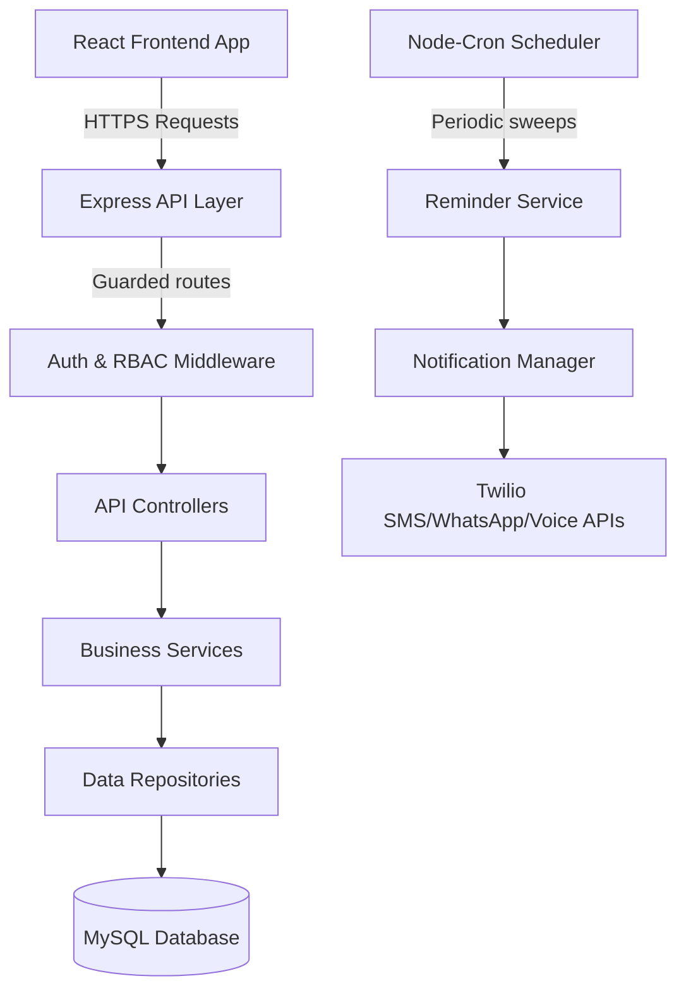
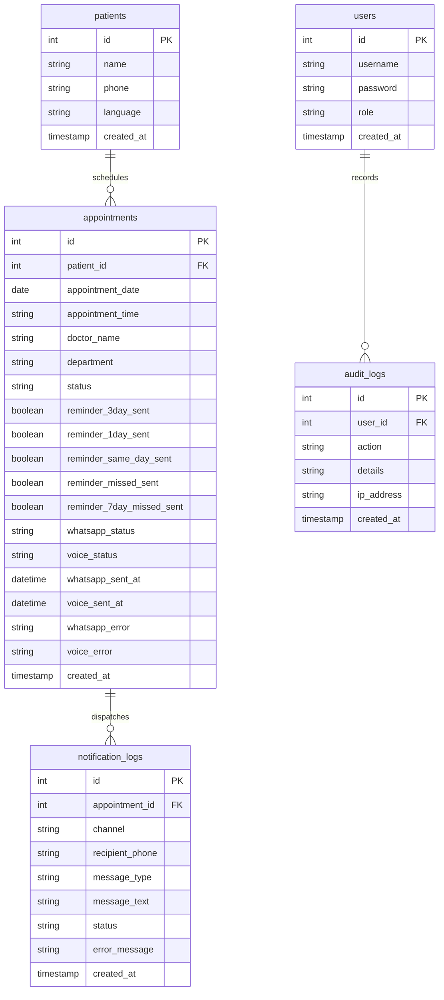

# Dermatology Appointment Reminder System (AVBRH Hospital)

A production-ready hospital application for managing patient appointments, tracking checking lifecycles, and dispatching intelligent reminders across SMS, WhatsApp, and Voice channels.

---

## 1. System Architecture & Tech Stack



### Technology Stack
*   **Frontend**: React (SPA), Vite, Tailwind CSS, Lucide icons, Recharts
*   **Backend**: Node.js, Express.js (REST API), JWT Auth, Node-Cron, PDFKit, ExcelJS
*   **Database**: MySQL (Prepared statements, custom indexing)
*   **Communication APIs**: Twilio (SMS API, WhatsApp Sandbox, Voice Call TTS)

The system uses a strict **Controller ➔ Service ➔ Repository** layout ensuring proper separation of concerns:
*   **Controller**: Handles incoming requests, validates input parameters, and returns REST JSON responses.
*   **Service**: Coordinates domain logic, message text template assembly, and Twilio channels.
*   **Repository**: Handles raw MySQL parameter-safe SQL queries.

---

## 2. Folder Structure

```
dermo-reminder-system/
├── config/                 # Configurations and multilingual message templates
├── controllers/            # API Controllers (Auth, Patient, Appointment, Analytics, Reports)
├── cron/                   # Cron scheduler setups
├── database/               # Database migration and DDL scripts
├── logs/                   # Persistent system log files (app, errors, cron, notifications)
├── middleware/             # Route authentication and role restriction guards
├── repositories/           # Direct SQL queries and DB connections wrappers
├── routes/                 # Express REST endpoint maps
├── services/               # Core business services (WhatsApp, Voice, Notification Manager, Exporters)
├── utils/                  # Centralized file logging, masking, and session helper utilities
├── validators/             # Request payload sanitization rules
├── frontend/               # React client application (Vite, Tailwind, Recharts)
│   ├── src/
│   │   ├── components/     # Visual cards, tables, progress meters, and navbar layout
│   │   ├── pages/          # Login, add patient, schedules, history dashboards
│   │   └── services/       # Frontend client api wrappers
│   └── dist/               # Compiled frontend production assets
├── server.js               # Entry-point runner
└── README.md               # Master document
```

---

## 3. Database Schema Documentation



### Table Details:
1.  **`users`**: System login accounts. Role matches one of `'super_admin'`, `'admin'`, or `'receptionist'`.
2.  **`patients`**: Stores names, contact phones, and language preference (`'english'`, `'hindi'`, or `'marathi'`).
3.  **`appointments`**: Manages schedules, consultants, checking statuses, and delivery flags.
4.  **`notification_logs`**: Auditing history of SMS, WhatsApp, and Voice dispatch attempts.
5.  **`audit_logs`**: System activity audits tracking operations (logins, cancellations, check-ins).

---

## 4. Reminder Timeline Workflow

Intelligent sweeps run automatically on set cron schedules to capture target appointment windows:

| Timeline | Execution Hour | Target Date Calculation | Active Channels | Purpose |
| --- | --- | --- | --- | --- |
| **3-Day Reminder** | 9:00 AM – 6:00 PM | `Appt Date = Current + 3 Days` | SMS + WhatsApp + Voice | Initial warning |
| **1-Day Reminder** | 9:00 AM – 6:00 PM | `Appt Date = Current + 1 Day` | SMS + WhatsApp + Voice | Final verification |
| **Same-Day Reminder** | **7:30 AM – 8:00 AM** | `Appt Date = Current + 0 Days` | SMS + WhatsApp + Voice | Action trigger |
| **Next-Day Missed** | 9:00 AM – 6:00 PM | `Status = 'missed' AND missed_sent = FALSE` | SMS + WhatsApp + Voice | Recall attempt |
| **7-Day Missed** | 9:00 AM – 6:00 PM | `Appt Date = Current - 7 Days AND Status = 'missed'` | SMS + WhatsApp + Voice | Final fallback |

---

## 5. Role Permissions Matrix

The system restricts access both at the UI components layout layer and on the backend REST controller endpoints:

| Feature / Action | Super Admin | Admin | Receptionist | Backend API Protection |
| --- | :---: | :---: | :---: | --- |
| **Register Patients** | Yes | Yes | Yes | Authenticated Session |
| **Schedule Appointments** | Yes | Yes | Yes | Authenticated Session |
| **Mark Visited / Missed** | Yes | Yes | Yes | Authenticated Session |
| **Reschedule Appointments** | Yes | Yes | **No** | Admin role guard |
| **Cancel Appointments** | Yes | Yes | **No** | Admin role guard |
| **Access Patient History** | Yes | Yes | **No** | Admin role guard |
| **View Analytics & Telemetry** | Yes | Yes | **No** | UI hidden / Admin routes guard |
| **View & Export Reports** | Yes | Yes | **No** | UI hidden / Admin routes guard |
| **Configure System Toggles** | Yes | Yes | **No** | UI hidden / Admin routes guard |
| **Staff Accounts Management** | Yes | **No** | **No** | Superadmin routes guard |

---

## 6. API Documentation

### Authentication:
*   `POST /auth/login` - Public login endpoint. Returns JWT token.
*   `POST /auth/logout` - Logs out current session.
*   `GET /auth/me` - Retrieve metadata of currently authenticated session.

### Patients Management:
*   `GET /patients` - Retrieve list of patients (Supports server-side pagination, searching, sorting).
*   `POST /patients` - Add new patient.
*   `GET /patients/:id/history` - Get patient history (Admin/Super Admin only).

### Appointments Management:
*   `GET /appointments` - List scheduled appointments (Supports server-side pagination, searching, sorting, filters).
*   `POST /appointments` - Schedule new appointment.
*   `PUT /appointments/:id/reschedule` - Reschedule appointment and synchronize flags (Admin/Super Admin only).
*   `PUT /appointments/:id/visited` - Mark appointment as Visited.
*   `PUT /appointments/:id/missed` - Mark appointment as Missed.
*   `PUT /appointments/:id/cancel` - Cancel appointment (Admin/Super Admin only).

---

## 7. Installation & Execution Guide

### Prerequisites:
*   Node.js (v18+)
*   MySQL (v8.0+)
*   Twilio Account (Active credentials)

### Step 1: Install Dependencies
```bash
# Install backend dependencies
npm install

# Install frontend dependencies
cd frontend
npm install
```

### Step 2: Configure Environment (.env)
Create `.env` in the root directory:
```env
PORT=3001
DB_HOST=localhost
DB_USER=root
DB_PASSWORD=your_secure_password
DB_NAME=dermo_reminder_system

JWT_SECRET=use_a_long_random_hex_string
JWT_EXPIRES_IN=12h

TWILIO_ACCOUNT_SID=AC...
TWILIO_AUTH_TOKEN=your_token
TWILIO_PHONE_NUMBER=+1...
TWILIO_WHATSAPP_NUMBER=+14155238886

MOCK_SMS=true  # Set to false to send real SMS, WhatsApp and Voice calls
ALLOWED_ORIGINS=http://localhost:5173,http://localhost:3000
```

### Step 3: Run Database Migrations
Create databases and run scripts:
```bash
node database/create-users-table.js
node database/upgrade-appointments-table.js
node database/add-reminder-indexes.js
node database/add-whatsapp-tracking.js
```

### Step 4: Run Application
To start both servers locally:
```bash
# In Root (Start Backend)
npm start

# In /frontend (Start Frontend Dev server)
cd frontend
npm run dev
```

---

## 8. Future Scope & Roadmap
*   **Scale Multi-Departmentally**: Expand tables to support hospital-wide scheduling (Orthopedics, Pediatrics, etc.) with custom message templates.
*   **Two-Way Conversations**: Implement Twilio webhook endpoints to process quick-replies (e.g. reply '1' to confirm rescheduling).
*   **EHR Integration**: Synchronize clinic check-ins with local hospital Electronic Health Records databases automatically.
